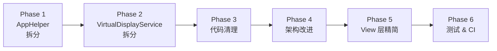
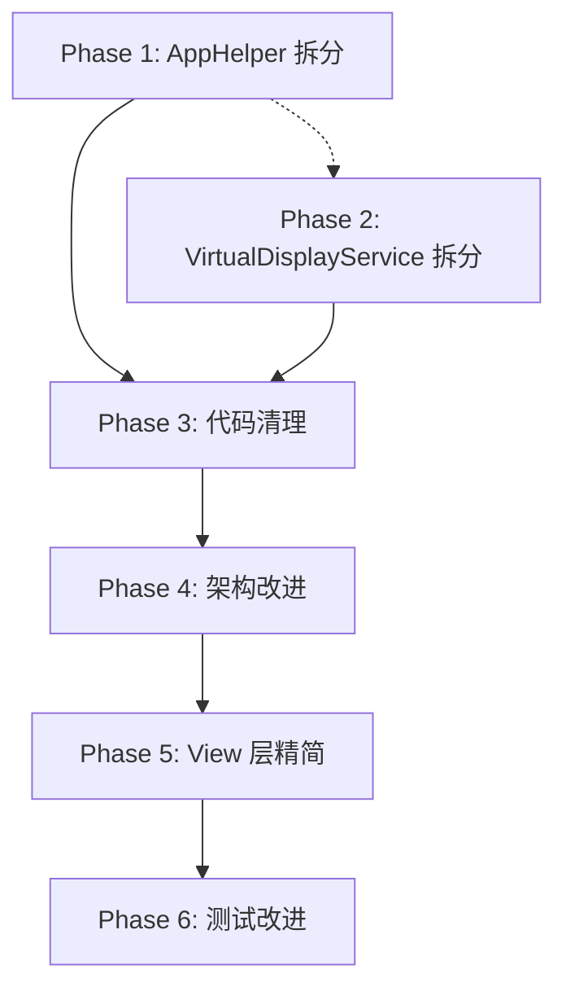

# VoidDisplay Refactoring Plan

> **执行者**: GPT / Codex 模型  
> **约束**: 功能不变、不需要向后兼容

---

## 项目概况

VoidDisplay 是一个 macOS 原生 SwiftUI 应用，功能包括：

1. **虚拟显示器管理**：创建、启用/禁用、销毁虚拟显示器  
2. **屏幕共享**：通过内置 Web 服务器以 MJPEG 串流屏幕画面  
3. **屏幕监控**：对显示器进行实时监控/预览

| 指标 | 数值 |
|------|------|
| 源文件 | 49 (.swift) |
| 单元测试 | 28 (.swift) |
| UI 测试 | 4 (.swift) |
| 最大单文件 | `VirtualDisplayService.swift` — **1893 行** |
| 第二大文件 | `VoidDisplayApp.swift` — **675 行** (含 `AppHelper` 580 行) |

---

## 已识别问题清单

| # | 分类 | 问题 | 位置 |
|---|------|------|------|
| 1 | God Object | `AppHelper` 承担了虚拟显示器、共享、监控三大功能域的全部状态同步和业务逻辑 | `App/VoidDisplayApp.swift` |
| 2 | 巨型文件 | `VirtualDisplayService.swift` 包含服务逻辑、拓扑修复、系统 API 调用、协议声明，共 1893 行 | `Features/VirtualDisplay/Services/` |
| 3 | 手动状态同步 | `syncSharingState()` / `syncVirtualDisplayState()` / `syncCaptureMonitoringState()` 每次操作后手动调用，容易遗漏 | `AppHelper` 全部方法 |
| 4 | 废弃别名 | `@available(*, deprecated) typealias WebServiceControlling = WebServiceControllerProtocol` | `WebServiceController.swift` |
| 5 | 过度防御 | `UUID(uuidString: "...") ?? UUID()` 用于硬编码常量 UUID | `uiTestVirtualDisplayConfigs()` |
| 6 | 散落的测试钩子 | `#if DEBUG` 测试方法（6 个）直接内联在生产代码中 | `VirtualDisplayService.swift:1550-1597` |
| 7 | 文件头注释遗留 | `HomeView.swift` 文件头写的 `ContentView.swift` | `App/HomeView.swift` |
| 8 | 未使用的 import | `ShareView.swift` 同时引入 `Cocoa` 和 `CoreGraphics`；多处重复引入 | 多处 View 文件 |
| 9 | 协议在实现文件底部 | `VirtualDisplayServiceProtocol` 声明在实现类的同一文件末尾 1847-1892 行 | `VirtualDisplayService.swift` |
| 10 | UI 测试逻辑混入生产代码 | `isUITestMode` 分支散布在 `AppHelper` 的 `getConfig` / `updateConfig` / `applyModes` 等方法中 | `VoidDisplayApp.swift` |
| 11 | 重复的 bounds 有效性检查  | `bounds.width > 1 && bounds.height > 1` 在 `VirtualDisplayService` 中出现 6 次 | `VirtualDisplayService.swift` |
| 12 | View 文件过长 | `ShareView.swift` 618 行, `VirtualDisplayView.swift` 444 行 | Views 层 |

---

## 重构阶段



> [!IMPORTANT]
> 每个阶段完成后应确保项目可以编译通过 + 现有测试全部通过，再进入下一阶段。

---

### Phase 1: AppHelper God Object 拆分

**目标**: 将 580 行 `AppHelper` 拆分为三个领域控制器 + 一个轻量的 `AppHelper` 外观。

#### [NEW] [VirtualDisplayController.swift](file:///Users/syc/Project/VoidDisplay/VoidDisplay/App/VirtualDisplayController.swift)

从 `AppHelper` 中提取所有虚拟显示器相关的状态和方法：

- 所有 `displays`, `displayConfigs`, `runningConfigIds`, `restoreFailures` 状态属性
- `rebuildingConfigIds`, `rebuildFailureMessageByConfigId`, `recentlyAppliedConfigIds` 和 `rebuildPresentationState`
- 所有 `rebuildTasksByConfigId`, `appliedBadgeClearTasksByConfigId` Task 管理
- 方法：`createDisplay`, `createDisplayFromConfig`, `disableDisplay`, `enableDisplay`, `destroyDisplay`, `getConfig`, `updateConfig`, `moveDisplayConfig`, `applyModes`, `rebuildVirtualDisplay`, `startRebuildFromSavedConfig`, `retryRebuild`, 等
- 使用 `@Observable` + `@MainActor`
- 持有 `VirtualDisplayServiceProtocol` 依赖

#### [NEW] [SharingController.swift](file:///Users/syc/Project/VoidDisplay/VoidDisplay/App/SharingController.swift)

从 `AppHelper` 中提取所有屏幕共享相关的状态和方法：

- `activeSharingDisplayIDs`, `sharingClientCount`, `sharingClientCounts`, `isSharing`, `isWebServiceRunning`, `webServer`
- 方法：`startWebService`, `stopWebService`, `registerShareableDisplays`, `beginSharing`, `stopSharing`, `stopAllSharing`, `refreshSharingClientCount`, `sharePagePath`, `sharePageURLResolution`, `sharePageURL`, `sharePageAddress`
- 持有 `SharingServiceProtocol` 依赖

#### [NEW] [CaptureController.swift](file:///Users/syc/Project/VoidDisplay/VoidDisplay/App/CaptureController.swift)

从 `AppHelper` 中提取屏幕监控相关的状态和方法：

- `screenCaptureSessions`
- 方法：`monitoringSession(for:)`, `addMonitoringSession`, `markMonitoringSessionActive`, `removeMonitoringSession`, `stopDependentStreamsBeforeRebuild`
- 持有 `CaptureMonitoringServiceProtocol` 依赖

#### [MODIFY] [VoidDisplayApp.swift](file:///Users/syc/Project/VoidDisplay/VoidDisplay/App/VoidDisplayApp.swift)

- `AppHelper` 缩减为外观类，持有三个 Controller 的引用
- `AppHelper` 仅做初始化协调和环境注入
- UI 测试 fixture 逻辑移入独立的 `UITestFixture.swift`
- `AppSettingsView` 移入独立文件 `App/AppSettingsView.swift`
- `CaptureDisplayWindowRoot` 移入独立文件或就近放到 `CaptureDisplayView.swift`

#### [NEW] [UITestFixture.swift](file:///Users/syc/Project/VoidDisplay/VoidDisplay/App/UITestFixture.swift)

- 提取 `applyUITestFixture()` 和 `uiTestVirtualDisplayConfigs()`
- 消除 `UUID(uuidString: "...") ?? UUID()` 模式，改为 `UUID(uuidString: "...")!`（已知合法常量）

---

### Phase 2: VirtualDisplayService 拆分

**目标**: 将 1893 行巨型文件拆分为职责清晰的模块。

#### [NEW] [DisplayTopology.swift](file:///Users/syc/Project/VoidDisplay/VoidDisplay/Features/VirtualDisplay/Services/DisplayTopology.swift)

从 `VirtualDisplayService.swift` 提取：

- `DisplayTopologySnapshot` struct（当前 L5-L22）
- `DisplayTopologyInspecting` protocol（当前 L24-L30）
- `DisplayTopologyRepairing` protocol（当前 L32-L38）
- `SystemDisplayTopologyInspector` struct（当前 L1664-L1703）
- `SystemDisplayTopologyRepairer` struct（当前 L1705-L1845）

#### [NEW] [DisplayReconfigurationMonitor.swift](file:///Users/syc/Project/VoidDisplay/VoidDisplay/Features/VirtualDisplay/Services/DisplayReconfigurationMonitor.swift)

从 `VirtualDisplayService.swift` 提取：

- `DisplayReconfigurationMonitoring` protocol（当前 L1600-L1604）
- `DisplayReconfigurationMonitor` class（当前 L1606-L1662）

#### [NEW] [VirtualDisplayServiceProtocol.swift](file:///Users/syc/Project/VoidDisplay/VoidDisplay/Features/VirtualDisplay/Services/VirtualDisplayServiceProtocol.swift)

从 `VirtualDisplayService.swift` 底部提取：

- `VirtualDisplayServiceProtocol`（当前 L1847-L1892）
- `extension VirtualDisplayService: VirtualDisplayServiceProtocol {}`

#### [NEW] [TopologyHealthEvaluator.swift](file:///Users/syc/Project/VoidDisplay/VoidDisplay/Features/VirtualDisplay/Logic/TopologyHealthEvaluator.swift)

从 `VirtualDisplayService.swift` 提取拓扑健康评估逻辑：

- `TopologyHealthEvaluation` struct（当前 L799-L811）
- `evaluateTopologyHealth(_:)` → 转为独立方法或静态方法
- `areManagedDisplaysCollapsedIntoSingleMirrorSet` 
- `areManagedDisplaysOverlappingInExtendedSpace`
- `mirrorRoot(for:snapshot:)`
- `selectRepairAnchorDisplayID`
- `shouldEnforceMainContinuity`
- 将反复出现的 `bounds.width > 1 && bounds.height > 1` 提取为 `DisplayTopologySnapshot.DisplayInfo` 的计算属性 `isViable: Bool`

#### [MODIFY] [VirtualDisplayService.swift](file:///Users/syc/Project/VoidDisplay/VoidDisplay/Features/VirtualDisplay/Services/VirtualDisplayService.swift)

执行以上提取后：

- 移除 `#if DEBUG` 测试方法（L1550-L1597），改为通过 `@testable import` 和 `internal` 可见性实现
- 将 `systemManagedDisplayOnline` 和 `systemOnlineDisplayIDs` 提取为可注入依赖（已通过 `managedDisplayOnlineChecker` 实现，移除静态方法）
- 最终目标：**~800 行**

---

### Phase 3: 代码清理

**目标**: 移除无用代码、过度防御、遗留兼容性写法。

#### 全局清理项

| 操作 | 文件 | 具体内容 |
|------|------|----------|
| 删除废弃别名 | `WebServiceController.swift` | 移除 `@available(*, deprecated) typealias WebServiceControlling` |
| 修复文件头注释 | `HomeView.swift` | `ContentView.swift` → `HomeView.swift` |
| 清理无用 import | `ShareView.swift` | 移除 `Cocoa` (已通过 `SwiftUI` 覆盖), 可能也移除冗余的 `CoreGraphics` |
| 清理无用 import | `CaptureChoose.swift` | 移除 `Cocoa`, `CoreGraphics` (通过 SwiftUI 和 ScreenCaptureKit 已覆盖) |
| 清理无用 import | `ShareViewModel.swift` | 移除 `Cocoa` |
| 统一错误处理 | `VirtualDisplayPersistenceService.swift` | 保留 `reset -> fallback save([])` 容错语义，不做删除；补齐该分支的失败路径测试与日志断言，明确触发条件与可观测性 |
| 消除冗余 guard | `VirtualDisplayService.enableDisplay()` | `terminationConfirmed` 和 `offlineVerified` 在多个分支中被重复赋值 `true`，简化控制流 |
| 提取重复代码 | `VirtualDisplayService` | `disableDisplay` 和 `disableDisplayByConfig` 有大量重复的运行时清理代码，提取共用方法 |

---

### Phase 4: 架构改进

**目标**: 让架构更符合 macOS 最佳实践，提升可测试性。

#### 4.1 消除手动状态同步

当前 `AppHelper`（重构后为各 Controller）中每个操作后都手动调用 `syncXxxState()`。改为：

- 使用 Swift `@Observable` 的 `withObservationTracking` 或 Combine `ObjectWillChange` 机制
- 或在 Service 层使用 `didSet` / `willSet` 自动通知
- **最低限度方案**：在每个 Controller 中统一使用 `defer { syncState() }` 模式，减少遗漏风险

#### 4.2 消除 UI 测试分支渗透

当前在 `AppHelper.getConfig` / `updateConfig` / `applyModes` 中有 `if isUITestMode` 分支。改为：

- 创建 `MockVirtualDisplayController` 在 UI 测试时注入
- 生产代码中完全消除 `isUITestMode` 检查

#### 4.3 整理测试钩子

`VirtualDisplayService` 中的 `#if DEBUG` 测试方法：

- `waitForManagedDisplayOfflineForTesting`
- `seedRuntimeBookkeepingForTesting`  
- `runtimeBookkeepingForTesting`
- `simulateEnablePostTopologyFailureRollbackForTesting`
- `replaceDisplayConfigsForTesting`
- `ensureHealthyTopologyAfterEnableForTesting`

**策略**: 将需要的字段改为 `internal` 可见性（`@testable import` 已可访问），或通过 `TopologyHealthEvaluator` 独立类暴露测试接口，移除 `#if DEBUG` 包裹。

#### 4.4 `AppObservability` 改进

- `AppLog` 和 `AppErrorMapper` 已足够好，保持不变
- 考虑为 `AppErrorMapper.logFailure` 添加 `file:` / `line:` 默认参数以便调试

---

### Phase 5: View 层精简

**目标**: 拆分过长的 View 文件，提升可读性。

#### [MODIFY] [ShareView.swift](file:///Users/syc/Project/VoidDisplay/VoidDisplay/Features/Sharing/Views/ShareView.swift)

618 行，拆分为：

- `ShareView.swift` — 主视图骨架 + 路由逻辑（~100 行）
- `ShareDisplayList.swift` — 显示器列表 + 行组件（~200 行）
- `ShareStatusPanel.swift` — 状态面板 + 底栏（~100 行）

#### [MODIFY] [VirtualDisplayView.swift](file:///Users/syc/Project/VoidDisplay/VoidDisplay/Features/VirtualDisplay/Views/VirtualDisplayView.swift)

444 行。将 `virtualDisplayRow` 和 toolbar 操作按钮提取为子视图：

- `VirtualDisplayRow.swift` — 单行组件（~120 行）

#### [MODIFY] [CaptureChoose.swift](file:///Users/syc/Project/VoidDisplay/VoidDisplay/Features/Capture/Views/CaptureChoose.swift)

347 行。将 `captureDisplayRow` 和 `monitoringSessionRow` 提取：

- `CaptureDisplayRow.swift` — 显示器行组件

---

### Phase 6: 测试 & CI 改进

**目标**: 确保重构后测试覆盖率不低于现有水平，新提取的模块有独立测试。

#### 新增测试

| 测试文件 | 覆盖目标 |
|----------|----------|
| `VirtualDisplayControllerTests.swift` | 新提取的 `VirtualDisplayController` 的状态管理和 rebuild 逻辑 |
| `SharingControllerTests.swift` | 新提取的 `SharingController` 的 web service 启停和 client count |
| `TopologyHealthEvaluatorTests.swift` | 独立的拓扑健康评估逻辑（纯函数测试） |
| `DisplayTopologyTests.swift` | `DisplayTopologySnapshot` 的便利方法（`isViable` 等） |

#### 现有测试更新

- `AppHelperTests.swift` — 适配新的 Controller 结构
- `VirtualDisplayServiceOfflineWaitTests.swift` — 移除 `#if DEBUG` 依赖
- `VirtualDisplayTopologyRecoveryTests.swift` — 适配 `TopologyHealthEvaluator` 提取

---

## 执行顺序和依赖关系



> [!TIP]
> Phase 1 和 Phase 2 可以并行执行，但推荐先做 Phase 1，因为 `AppHelper` 中的方法移动会影响后续 Phase 2 对 `VirtualDisplayServiceProtocol` 的依赖调整方向。

---

## 验证计划

### 自动化测试

每个 Phase 完成后执行：

```bash
# 编译检查
xcodebuild build \
  -project VoidDisplay.xcodeproj \
  -scheme VoidDisplay \
  -destination 'platform=macOS,arch=arm64' \
  -configuration Debug

# 运行全部单元测试
scripts/test/unit_gate.sh \
  --project /Users/syc/Project/VoidDisplay/VoidDisplay.xcodeproj \
  --destination "platform=macOS,arch=arm64" \
  --derived-data-path .derivedData \
  --result-bundle-path UnitTests.xcresult \
  --enable-code-coverage YES \
  --only-testing VoidDisplayTests \
  --skip-testing VoidDisplayUITests
```

### 覆盖率检查

使用已有的 coverage 脚本：

```bash
scripts/test/coverage_guard.sh --xcresult UnitTests.xcresult
```

### 静态检查

```bash
# 确认没有编译警告
xcodebuild build \
  -project VoidDisplay.xcodeproj \
  -scheme VoidDisplay \
  -destination 'platform=macOS' \
  -configuration Debug \
  2>&1 | grep -i "warning:" | grep -v "deprecated" | head -20
```

### 人工验证

重构完成后请用户：

1. 在 Xcode 中打开项目并运行（Cmd+R），确认所有 4 个页面正常渲染
2. 创建一个虚拟显示器 → 启用 → 禁用 → 重建 → 删除
3. 开启屏幕共享 → 在浏览器中访问共享页面 → 停止共享
4. 开启屏幕监控 → 确认画面实时更新 → 停止监控

---

## 预期成果

| 指标 | 重构前 | 重构后目标 |
|------|--------|-----------|
| `VoidDisplayApp.swift` 行数 | 675 | ~100 |
| `AppHelper` 行数 | 580 | ~60 (外观) + 3 × ~150 (Controllers) |
| `VirtualDisplayService.swift` 行数 | 1893 | ~800 |
| 新独立模块 | 0 | 5 (DisplayTopology, ReconfigurationMonitor, TopologyHealthEvaluator, Protocol, Controllers) |
| `#if DEBUG` 测试钩子 | 6 个方法 | 0 |
| 手动 sync 调用 | ~25 处 | 集中化或消除 |
| 单元测试文件 | 28 | 32+ |
